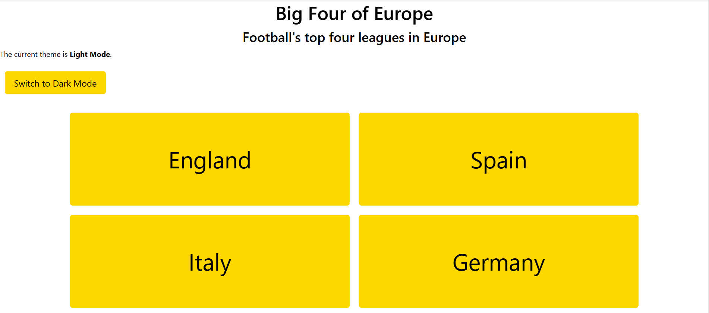
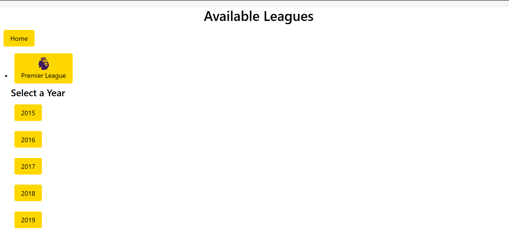
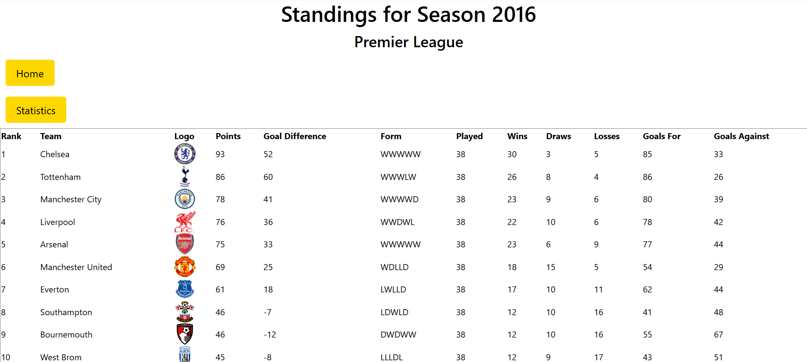
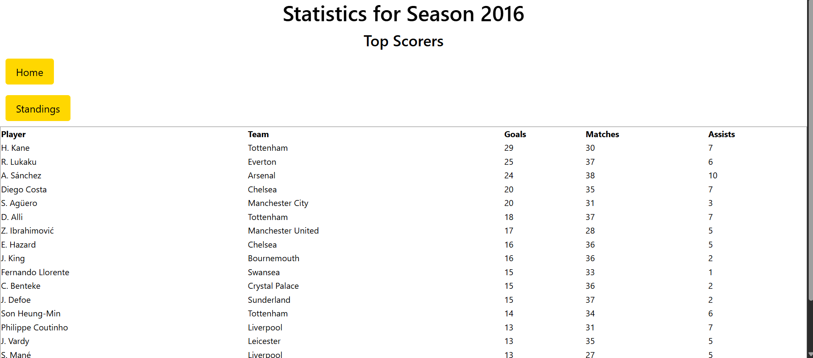

App Name: Big Four of Europe

Background Information: The content of this app is mainly based on the major football leagues of the "Big Four". The "Big Four" is often described as the 4 best football countries in Europe, namely England, Italy, Spain and Germany. As an avid football fan myself, I wanted to create an app using data fetched from an API based on information and data that I am highly comfortable with, hence I decided to go for a football theme app. The API that I am using to pull data from is called API-Football. Since football is known world-wide, this API contains data from almost all the countries and leagues around the world. Therefore, during the process of building this app and fetching data, I paid close attention to the four countries mentioned above, and specifically to their respective major league which are Premier League, Serie A, Bundesliga and La Liga.

The files of the app can be accessed through the following github url:
https://github.com/FairuzFairuz/Unit2ReactAppProject.git

Planning Process:

1. Scouted for a suitable API from the given list
2. Explored chosen API by fetching data in Postman
3. Decided on the data to be fetched (country, leagues, year)
4. Planned out User Stories for the app
5. Created a wireframe diagram on the various user interface of the app
6. Identified and created the components needed
7. Created functions for various components to achieve the intended output
8. Created Airtable and decided on the data to be created and stored in Airtable API
9. Finalize the appearance of the app

Screenshot of Home Page of App:

Screenshot of LeagueList of App:

Screenshot of StandingsPage of App:

Screenshot of StatisticsPage of App:

Hierachy of App:

.env keys:
API key: bb9f4deed51b4d66a5a0dfe84fc072ad
Airtable token/key: patwezA0qulTsaQDt.9cd387f718bf4407daa5b030f7eea02db163ae5499f7f7fc263fc7c146425e16

Technologies Used:
React
CSS
Airtable
Trello
Postman
API-Football

Future Improvements:
Since the API contains multiple football data from various leagues, potential improvements would include but not limited to the following:

1. Include more leagues in the 4 countries
2. Include more statistics such as top assists, top red cards, top yellow cards
3. Improve the appearance of the app by incorporating more football related themes, such as stadiums and balls
